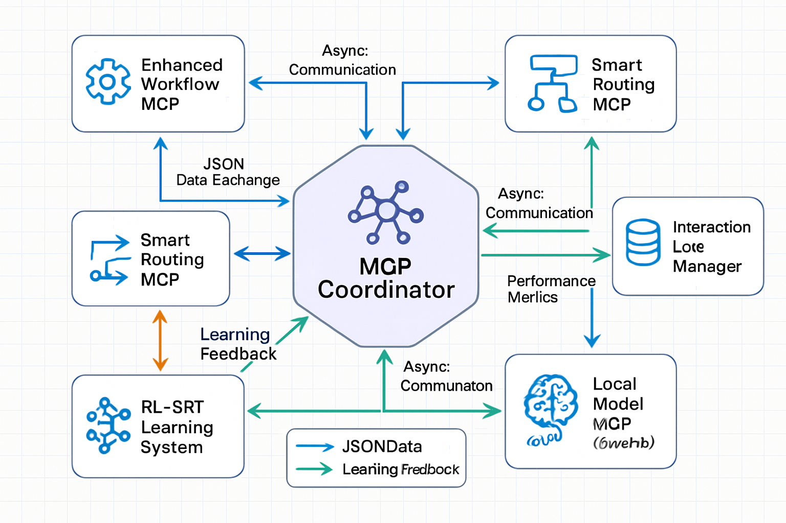
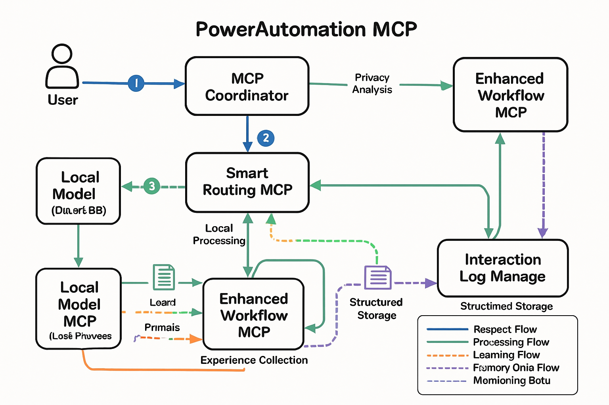

# PowerAutomation MCP架构关系分析报告

**作者**: Manus AI  
**日期**: 2025年6月17日  
**版本**: 1.0  
**项目**: PowerAutomation MCP生态系统架构分析

## 执行摘要

本报告深入分析了PowerAutomation系统中六个核心组件之间的复杂关系网络：Enhanced Workflow MCP、Smart Routing MCP、interaction_log_manager、local_model_mcp、mcpcoordinator和rl_srt。通过对源代码的详细审查、依赖关系分析和数据流追踪，我们揭示了这些组件如何协同工作以实现智能化的端云协作和自适应学习系统。

研究发现，这些组件构成了一个高度集成的生态系统，其中MCPCoordinator作为中央协调器统一管理所有交互数据，Smart Routing系统基于隐私敏感度和任务复杂度进行智能路由决策，而RL-SRT学习系统则通过持续学习不断优化系统性能。本报告为系统优化、架构改进和未来发展提供了重要的技术洞察和建议。

## 1. 引言与背景

PowerAutomation作为一个先进的智能自动化平台，其核心架构建立在模块化组件协作（MCP）的基础之上。在这个复杂的生态系统中，六个关键组件形成了一个紧密集成的网络，每个组件都承担着特定的职责，同时通过精心设计的接口和数据流与其他组件协作。

Enhanced Workflow MCP代表了工作流增强的核心能力，负责处理复杂的业务流程自动化任务。Smart Routing MCP则实现了智能路由决策，基于隐私敏感度、任务复杂度和资源可用性来确定最优的处理路径。interaction_log_manager作为交互数据的中央存储和管理系统，为整个生态系统提供了数据持久化和分析基础。local_model_mcp专注于本地模型的管理和执行，特别是Qwen 8B等大语言模型的本地部署和优化。mcpcoordinator充当整个系统的中央协调器，统一管理所有MCP组件的交互和数据流。最后，rl_srt（强化学习-自适应路由技术）系统通过持续学习和优化来提升整个系统的性能和决策质量。

这些组件之间的关系并非简单的线性依赖，而是形成了一个复杂的网状结构，其中数据流、控制流和反馈循环相互交织，共同构成了PowerAutomation的智能化核心。理解这些关系对于系统的维护、优化和扩展具有重要意义。

## 2. 组件现状分析

### 2.1 Enhanced Workflow MCP

Enhanced Workflow MCP目前处于Mock实现阶段，这表明该组件仍在开发过程中。从现有的代码结构来看，该组件被设计为一个异步处理系统，具备基本的请求处理、状态管理和信息查询功能。

当前实现的Enhanced Workflow MCP包含了标准的MCP接口，包括process方法用于处理业务请求，get_status方法用于状态查询，以及get_info方法用于模块信息获取。该组件维护了操作计数器和最后操作记录，为性能监控和调试提供了基础数据。虽然目前是Mock实现，但其接口设计已经为未来的完整实现奠定了基础。

从架构角度来看，Enhanced Workflow MCP被定位为一个适配器类型的MCP，这意味着它主要负责与外部系统或服务的集成，而不是核心的业务逻辑处理。这种设计符合MCP架构的模块化原则，使得系统能够灵活地集成不同的工作流引擎和自动化工具。

### 2.2 Smart Routing MCP

Smart Routing MCP的实现分布在多个文件中，主要包括smart_routing_system.py和smart_routing_analysis.py。这种分布式的实现反映了智能路由功能的复杂性和多层次特性。

smart_routing_system.py实现了核心的路由决策引擎，包括隐私敏感度分类器、任务复杂度分析器和本地能力评估器。隐私敏感度分类器能够识别高敏感、中等敏感和低敏感的内容，基于预定义的模式匹配和关键词检测。任务复杂度分析器则根据代码行数、函数数量和关键词来评估任务的复杂程度，从简单到超复杂分为四个等级。本地能力评估器维护了一个详细的能力矩阵，评估本地模型在不同任务类型上的处理能力。

smart_routing_analysis.py提供了对智能路由系统的深入分析，包括核心架构的文档化和决策算法的详细说明。该文件揭示了路由决策的五步流程：请求特征分析、本地处理能力评估、成本计算、路由决策逻辑和决策记录。

智能路由系统的设计体现了端云协作的核心理念，通过综合考虑隐私保护、性能优化和成本控制来做出最优的路由决策。这种多因素决策模型确保了系统能够在不同场景下选择最合适的处理方式。

### 2.3 Interaction Log Manager

Interaction Log Manager是整个PowerAutomation系统的数据基础设施，负责交互数据的分类存储、管理和分析。该组件的实现体现了企业级系统对数据管理的严格要求。

从代码结构来看，Interaction Log Manager定义了详细的数据模型，包括InteractionType枚举用于分类不同类型的交互，DeliverableType枚举用于标识不同类型的交付件。InteractionLog数据结构包含了完整的交互信息，从用户请求到代理响应，再到性能指标和上下文信息。

该组件的目录结构设计体现了数据分类管理的思想，按照交互类型和交付件类型分别创建不同的存储目录。这种结构化的存储方式不仅便于数据的组织和检索，也为后续的数据分析和挖掘提供了基础。

Interaction Log Manager还集成了KiloCode RAG（检索增强生成）功能，这表明该组件不仅仅是一个简单的日志存储系统，而是一个智能化的数据管理平台，能够支持基于历史数据的智能推荐和决策支持。

### 2.4 Local Model MCP

Local Model MCP是PowerAutomation系统中负责本地模型管理和执行的核心组件。该组件的实现展现了对多模型支持、OCR集成和性能优化的全面考虑。

从架构设计来看，Local Model MCP采用了模块化的设计方法，将模型管理、OCR引擎、设备工具和内存工具分离为独立的组件。这种设计使得系统能够灵活地支持不同的模型类型和硬件配置。

该组件支持Qwen 8B和Mistral 12B等多种大语言模型，通过配置文件来管理不同模型的参数和设置。OCR功能的集成使得系统能够处理图像和文档类型的输入，扩展了系统的应用场景。

性能统计功能的实现体现了对系统监控和优化的重视。通过跟踪请求处理数量、令牌生成数量、平均响应时间等指标，系统能够实时监控性能状况并为优化提供数据支持。

Local Model MCP还实现了OCR工作流接口，这表明该组件不仅仅是一个模型执行器，而是一个完整的工作流处理平台，能够支持复杂的多步骤处理流程。

### 2.5 MCP Coordinator

MCP Coordinator作为整个系统的中央协调器，承担着统一管理所有MCP组件交互数据的重要职责。该组件的设计体现了对数据统一管理和系统协调的深刻理解。

从代码实现来看，MCP Coordinator定义了完整的数据模型，包括InteractionRecord用于记录交互数据，MCPPerformanceMetrics用于跟踪性能指标，RoutingDecisionRecord用于记录路由决策。这些数据结构为系统的监控、分析和优化提供了坚实的基础。

InteractionDataManager作为核心的数据管理组件，实现了交互数据的统一存储、查询和分析功能。该组件确保所有MCP的交互数据都通过统一的接口进行管理，避免了数据分散和不一致的问题。

MCP Coordinator的设计原则明确规定了数据管理的职责分离：协调器统一管理所有交互数据，各MCP专注于业务逻辑处理而不存储交互数据，智慧路由基于全局交互数据进行决策。这种设计确保了系统的可扩展性和数据一致性。

### 2.6 RL-SRT学习系统

RL-SRT（强化学习-自适应路由技术）学习系统代表了PowerAutomation系统的自我学习和持续改进能力。该系统通过整合Manus日志和插件输入作为训练数据，实现了系统的自我优化。

从实现角度来看，RL-SRT系统采用了异步学习的架构，支持同步、异步和混合三种学习模式。这种灵活的学习模式设计使得系统能够在不同的运行环境和性能要求下选择最合适的学习策略。

LearningExperience数据结构定义了完整的学习经验记录，包括状态、动作、奖励和下一状态等强化学习的核心要素。这种结构化的经验记录为强化学习算法的实现提供了标准化的数据格式。

PerformanceMetrics的定义体现了对系统性能的全面考量，包括准确性、效率、用户满意度、响应时间、资源使用和学习速度等多个维度。这种多维度的性能评估确保了学习系统能够全面优化系统表现。

RLSRTLearningEngine的实现包含了策略网络和价值网络的概念，虽然当前是概念性的实现，但为未来的深度强化学习算法集成奠定了基础。异步学习队列和线程池的设计确保了学习过程不会影响系统的正常运行。

## 3. 组件间依赖关系分析

### 3.1 核心依赖网络

PowerAutomation系统中的六个核心组件形成了一个复杂的依赖网络，其中每个组件都与其他组件存在直接或间接的依赖关系。通过对源代码的深入分析，我们识别出了以下关键的依赖模式。

Interaction Log Manager作为基础数据层，被多个其他组件所依赖。Smart Routing系统直接导入了InteractionLogManager、InteractionType等核心类，表明路由决策需要基于历史交互数据进行分析和优化。RL-SRT学习系统同样依赖于Interaction Log Manager，通过InteractionLogManager、InteractionType和DeliverableType来获取训练数据和学习经验。

MCP Coordinator与Interaction Log Manager之间存在着紧密的协作关系。虽然两者都涉及交互数据的管理，但它们的职责有所不同：Interaction Log Manager专注于数据的存储和基础管理，而MCP Coordinator则负责更高层次的协调和决策支持。这种分层的设计避免了功能重复，同时确保了系统的模块化。

Local Model MCP通过其配置系统与其他组件建立连接。该组件的模型管理器、OCR引擎和工作流接口为其他组件提供了本地处理能力，特别是为Smart Routing系统的本地处理路径提供了技术支撑。

### 3.2 数据依赖关系

数据依赖关系是组件间最重要的依赖类型之一。在PowerAutomation系统中，数据依赖主要体现在以下几个方面。

首先，所有组件都依赖于Interaction Log Manager提供的数据模型和存储服务。InteractionType和DeliverableType枚举被多个组件引用，确保了数据分类的一致性。InteractionLog数据结构为系统提供了统一的交互数据格式，使得不同组件能够以标准化的方式处理和交换数据。

其次，Smart Routing系统的决策过程高度依赖于历史交互数据。路由决策算法需要分析过往的处理结果、性能指标和用户反馈来优化未来的路由选择。这种数据驱动的决策模式使得系统能够随着使用时间的增长而不断改进。

RL-SRT学习系统对数据的依赖更为复杂，它不仅需要当前的交互数据，还需要构建学习经验序列。LearningExperience数据结构将状态、动作、奖励和下一状态组织成强化学习所需的格式，为算法训练提供了标准化的数据输入。

MCP Coordinator通过InteractionRecord、MCPPerformanceMetrics和RoutingDecisionRecord等数据结构，建立了一个全面的数据管理体系。这些数据结构不仅记录了系统的运行状态，还为性能分析和系统优化提供了丰富的数据源。

### 3.3 功能依赖关系

功能依赖关系反映了组件间在业务逻辑层面的相互依赖。在PowerAutomation系统中，功能依赖主要表现为服务调用、接口依赖和工作流协作。

Enhanced Workflow MCP虽然目前是Mock实现，但其接口设计表明它将为其他组件提供工作流处理服务。该组件的process方法将被其他组件调用来执行复杂的业务流程，而get_status和get_info方法则为系统监控和管理提供支持。

Smart Routing系统的功能依赖体现在其对本地能力评估的需求上。LocalCapabilityAssessor需要了解Local Model MCP的实际处理能力，包括不同任务类型的处理质量和性能表现。这种依赖关系确保了路由决策的准确性和有效性。

Local Model MCP通过其OCR工作流接口为其他组件提供图像和文档处理能力。这种功能依赖使得系统能够处理多模态的输入，扩展了整个平台的应用范围。

MCP Coordinator的功能依赖主要体现在其协调和管理职责上。该组件需要与所有其他MCP组件建立通信连接，收集性能数据，记录交互信息，并为路由决策提供数据支持。

### 3.4 配置依赖关系

配置依赖关系涉及组件间在配置管理和参数传递方面的依赖。PowerAutomation系统采用了分层的配置管理策略，既保证了配置的灵活性，又确保了系统的一致性。

Local Model MCP的配置系统是最为复杂的，它需要管理多个模型的参数、OCR引擎的设置、设备配置和内存管理参数。这些配置不仅影响Local Model MCP自身的行为，还会影响Smart Routing系统的路由决策。

Smart Routing系统的配置包括隐私敏感度模式、任务复杂度阈值、本地能力评估参数和成本计算公式。这些配置参数直接影响路由决策的结果，需要与其他组件的能力和性能特征保持一致。

RL-SRT学习系统的配置涉及学习率、折扣因子、探索率等强化学习参数，以及异步学习的线程配置和队列大小。这些配置需要根据系统的实际运行情况和性能要求进行调优。

MCP Coordinator的配置主要涉及数据存储路径、性能监控参数和通信接口设置。这些配置需要与所有其他组件的配置保持兼容，确保系统的正常运行。

## 4. 数据流与通信机制分析

### 4.1 中央协调器数据流模式

PowerAutomation系统采用了中央协调器数据流模式，这是一种高度集中化的数据管理架构。在这种模式下，MCP Coordinator作为数据流的中心节点，所有组件间的数据交换都通过协调器进行中转和管理。

这种设计模式的核心优势在于数据一致性和系统可控性。通过将所有交互数据集中管理，系统能够确保数据的完整性和一致性，避免了分布式数据管理可能带来的同步问题和数据冲突。同时，中央协调器能够对所有数据流进行监控和审计，为系统的安全性和合规性提供保障。

从实现角度来看，MCP Coordinator通过InteractionDataManager实现了统一的数据接口。所有MCP组件在处理用户请求时，都需要通过这个接口记录交互数据、更新性能指标和报告处理结果。这种统一的接口设计简化了组件间的集成，降低了系统的复杂性。

数据流的具体路径如下：用户请求首先到达MCP Coordinator，协调器根据请求类型和当前系统状态选择合适的MCP组件进行处理。处理过程中的所有数据，包括中间结果、性能指标和错误信息，都会实时回传给协调器。协调器将这些数据整合后存储到Interaction Log Manager中，同时更新相关的性能统计和决策记录。

### 4.2 智能路由数据流

Smart Routing系统的数据流体现了智能决策的复杂性和多因素考量。路由决策过程涉及多个数据源和分析步骤，每个步骤都需要特定的数据输入和处理逻辑。

路由决策的数据流始于用户请求的特征分析。PrivacySensitivityClassifier需要分析请求内容，识别其中的敏感信息和隐私风险。这个过程依赖于预定义的敏感模式库和关键词检测算法。分析结果以PrivacySensitivity枚举的形式输出，为后续的路由决策提供隐私保护依据。

TaskComplexityAnalyzer负责评估任务的复杂程度，其数据输入包括请求内容、代码行数、函数数量等技术指标。分析算法基于预定义的复杂度指标和阈值，输出TaskComplexity枚举值。这个结果直接影响本地处理和云端处理的选择。

LocalCapabilityAssessor的数据流涉及本地模型能力的实时评估。该组件需要获取Local Model MCP的当前状态、可用资源和历史性能数据，结合任务类型和复杂度要求，计算本地处理的可行性和预期质量。

成本计算模块需要综合考虑本地处理成本和云端处理成本。本地处理成本主要包括计算资源消耗和时间成本，而云端处理成本则涉及API调用费用、数据传输成本和延迟损失。这些成本数据来自于历史统计和实时监控。

最终的路由决策基于所有这些数据输入，通过多因素决策算法生成RoutingDecision结果。决策结果不仅包括选择的处理路径，还包括决策置信度、备选方案和决策依据，为系统的透明性和可解释性提供支持。

### 4.3 学习系统数据流

RL-SRT学习系统的数据流体现了强化学习的特殊要求和复杂性。该系统需要将系统运行过程中的各种数据转换为强化学习算法所需的经验数据格式。

学习数据的来源主要包括Interaction Log Manager中的历史交互数据和实时的系统运行数据。历史数据提供了丰富的学习样本，包括不同类型的用户请求、处理结果、性能指标和用户反馈。实时数据则为在线学习提供了最新的经验样本。

数据转换过程将原始的交互数据转换为LearningExperience格式。状态数据包括当前的系统状态、用户请求特征和环境参数。动作数据记录了系统采取的具体行动，如路由决策、模型选择和参数配置。奖励数据基于处理结果的质量、用户满意度和系统性能计算得出。下一状态数据则记录了动作执行后的系统状态变化。

异步学习机制的数据流设计确保了学习过程不会影响系统的正常运行。学习队列接收实时的经验数据，学习线程池并行处理这些数据，更新策略网络和价值网络的参数。学习结果通过性能指标反馈给系统，用于评估学习效果和调整学习策略。

### 4.4 本地模型数据流

Local Model MCP的数据流涉及多模态数据的处理和多模型的协调。该组件需要处理文本、图像和配置等不同类型的输入数据，并通过不同的处理引擎生成相应的输出结果。

文本处理数据流通过模型管理器进行路由。根据任务类型和模型可用性，系统选择合适的语言模型（如Qwen 8B或Mistral 12B）进行处理。处理过程中的性能数据，包括令牌数量、处理时间和资源消耗，都会被实时记录和统计。

OCR数据流处理图像和文档输入。OCR引擎将图像数据转换为文本数据，然后可以进一步通过语言模型进行分析和处理。Mistral OCR引擎提供了云端OCR的备选方案，当本地OCR能力不足时可以切换到云端处理。

工作流数据流通过OCRWorkflowInterface实现复杂的多步骤处理。工作流请求包含了完整的处理流程定义，系统按照流程步骤依次执行，每个步骤的输出作为下一个步骤的输入。工作流结果包含了所有步骤的处理结果和性能统计。

性能监控数据流贯穿整个处理过程。系统实时收集请求处理数量、令牌生成数量、平均响应时间、模型切换次数等统计数据。这些数据不仅用于系统监控和性能优化，还为Smart Routing系统的决策提供重要参考。

### 4.5 组件间通信协议

PowerAutomation系统中的组件间通信遵循统一的协议规范，确保了不同组件之间的兼容性和互操作性。通信协议的设计考虑了异步处理、错误处理和性能优化等多个方面。

异步通信是系统的核心特征之一。所有主要的处理方法都采用了async/await模式，确保了系统的高并发处理能力。异步通信不仅提高了系统的响应性能，还避免了阻塞式调用可能带来的资源浪费和性能瓶颈。

错误处理协议确保了系统的健壮性和可靠性。每个组件都实现了完善的异常处理机制，包括输入验证、处理异常捕获和错误信息传递。错误信息以标准化的格式在组件间传递，便于问题诊断和系统维护。

数据序列化协议采用JSON格式作为主要的数据交换格式。JSON的可读性和跨平台兼容性使得系统能够方便地与外部系统集成，同时也简化了调试和维护工作。

性能监控协议要求所有组件在处理过程中记录关键的性能指标。这些指标包括处理时间、资源消耗、成功率等，为系统优化和容量规划提供数据支持。

安全通信协议涉及敏感数据的处理和传输。系统采用了加密存储和安全传输机制，确保用户数据和系统配置的安全性。隐私保护措施贯穿整个通信过程，符合数据保护法规的要求。

## 5. 协同工作机制深度分析

### 5.1 Enhanced Workflow MCP与Smart Routing MCP的协同

Enhanced Workflow MCP与Smart Routing MCP之间的协同关系体现了工作流处理与智能路由决策的深度融合。这种协同机制确保了复杂工作流能够在最优的执行环境中运行，同时保证了处理质量和效率的平衡。

在协同工作过程中，Smart Routing MCP首先分析工作流请求的特征，包括任务复杂度、数据敏感性和资源需求。基于这些分析结果，路由系统决定工作流的执行策略：是在本地环境中完全执行，还是采用混合执行模式，或者将整个工作流转移到云端处理。

Enhanced Workflow MCP接收到路由决策后，根据指定的执行策略调整其内部的处理流程。对于本地执行的工作流，该组件会优化资源分配和任务调度，确保在有限的本地资源下实现最佳性能。对于混合执行模式，组件需要协调本地处理和云端处理的数据交换，确保工作流的连续性和数据一致性。

反馈机制是协同工作的重要组成部分。Enhanced Workflow MCP在执行过程中持续向Smart Routing MCP报告执行状态、性能指标和资源消耗情况。这些反馈信息帮助路由系统实时调整决策策略，并为未来类似工作流的路由决策提供经验数据。

错误处理和恢复机制确保了协同工作的可靠性。当Enhanced Workflow MCP遇到执行困难或性能瓶颈时，Smart Routing MCP能够快速响应，重新评估路由策略并提供备选的执行方案。这种动态调整能力使得系统能够应对各种异常情况和变化的运行环境。

### 5.2 Smart Routing MCP与Local Model MCP的深度集成

Smart Routing MCP与Local Model MCP之间的集成关系是整个系统端云协作能力的核心。这种集成不仅涉及技术层面的接口对接，更重要的是实现了智能决策与本地处理能力的有机结合。

本地能力评估是集成的关键环节。Smart Routing MCP需要实时了解Local Model MCP的处理能力，包括当前可用的模型类型、模型性能特征、资源使用状况和处理队列长度。LocalCapabilityAssessor组件维护了一个详细的能力矩阵，涵盖了不同任务类型在本地模型上的处理质量和效率预期。

动态负载均衡机制确保了本地资源的最优利用。当Local Model MCP的负载较高时，Smart Routing MCP会自动将新的请求路由到云端处理，避免本地资源过载。相反，当本地资源充足且任务适合本地处理时，系统会优先选择本地处理路径，降低成本并提高响应速度。

模型选择优化是集成的另一个重要方面。Local Model MCP支持多种模型（如Qwen 8B和Mistral 12B），Smart Routing MCP需要根据任务特征和性能要求选择最合适的模型。这种选择不仅考虑模型的处理能力，还要考虑模型的资源消耗和响应时间。

OCR工作流的集成展现了多模态处理的复杂性。当用户请求涉及图像或文档处理时，Smart Routing MCP需要协调OCR处理和文本分析的执行顺序和位置。本地OCR引擎和Mistral OCR引擎的选择同样基于隐私要求、处理质量和成本考虑。

性能反馈循环确保了集成效果的持续优化。Local Model MCP的实际处理结果和性能数据会反馈给Smart Routing MCP，用于更新能力评估模型和优化路由决策算法。这种持续学习机制使得系统能够随着使用时间的增长而不断改进。

### 5.3 MCP Coordinator的中央协调作用

MCP Coordinator在整个系统中发挥着中央协调器的关键作用，它不仅管理着所有组件间的数据流，还负责系统级的决策协调和资源调度。这种中央协调模式确保了系统的一致性和可控性。

数据统一管理是协调器的核心功能。所有MCP组件的交互数据都通过InteractionDataManager进行统一管理，包括请求记录、响应数据、性能指标和错误信息。这种统一管理避免了数据分散和不一致的问题，为系统分析和优化提供了可靠的数据基础。

路由决策支持是协调器的重要职责。MCP Coordinator为Smart Routing MCP提供全局的系统状态信息，包括各个组件的负载情况、性能表现和可用性状态。这些信息帮助路由系统做出更加准确和及时的决策。

性能监控和分析功能使得协调器能够实时掌握系统的运行状况。MCPPerformanceMetrics数据结构记录了每个MCP组件的详细性能指标，包括请求处理数量、成功率、平均响应时间和质量评分。这些指标不仅用于系统监控，还为容量规划和性能优化提供依据。

异常处理和恢复机制确保了系统的高可用性。当某个MCP组件出现故障或性能下降时，协调器能够快速检测并启动恢复流程，包括负载重新分配、备用组件激活和用户通知等。

配置管理和版本控制功能使得协调器能够统一管理所有组件的配置参数和版本信息。这种集中式的配置管理简化了系统维护和升级工作，确保了配置的一致性和兼容性。

### 5.4 RL-SRT学习系统的智能优化

RL-SRT学习系统通过强化学习算法实现了整个PowerAutomation系统的智能优化和自适应改进。该系统的工作机制体现了人工智能在系统优化中的深度应用。

经验数据收集是学习系统的基础工作。系统持续收集来自所有MCP组件的运行数据，包括用户请求、处理结果、性能指标和用户反馈。这些数据被转换为LearningExperience格式，形成强化学习算法的训练样本。

状态空间建模是学习系统的核心技术挑战。系统需要将复杂的运行环境抽象为可量化的状态向量，包括系统负载、资源可用性、任务队列长度、历史性能等多个维度。状态空间的设计直接影响学习算法的效果和收敛速度。

动作空间定义涵盖了系统可以采取的所有优化行动，包括路由策略调整、资源分配优化、模型参数调整和工作流配置修改等。动作空间的合理设计确保了学习系统能够探索有效的优化策略。

奖励函数设计是强化学习的关键要素。系统采用多目标奖励函数，综合考虑处理质量、响应时间、资源利用率、用户满意度和成本效益等多个指标。奖励函数的权重可以根据业务需求和运行环境进行动态调整。

异步学习架构确保了学习过程不会影响系统的正常运行。学习队列缓存实时的经验数据，学习线程池并行处理这些数据，更新策略网络和价值网络。学习结果通过参数更新的方式影响系统的决策行为。

学习效果评估机制通过A/B测试和性能对比来验证学习算法的有效性。系统定期比较学习前后的性能指标，确保学习过程确实带来了系统改进。无效的学习结果会被回滚，避免对系统性能造成负面影响。

### 5.5 Interaction Log Manager的数据基础设施作用

Interaction Log Manager作为整个系统的数据基础设施，为所有其他组件提供了统一的数据存储、管理和分析服务。其设计和实现体现了企业级数据管理的最佳实践。

分类存储机制根据交互类型和数据特征将数据存储在不同的目录结构中。这种分类存储不仅提高了数据检索效率，还便于数据的生命周期管理和归档处理。技术分析、代码生成、测试、文档等不同类型的交互数据被分别存储，便于专门的分析和处理。

数据模型标准化确保了所有组件使用一致的数据格式和结构。InteractionLog、Deliverable等数据结构定义了标准的数据模式，使得不同组件能够无缝地共享和交换数据。这种标准化减少了数据转换的复杂性和错误风险。

KiloCode RAG集成功能将历史交互数据转换为知识库，支持基于历史经验的智能推荐和决策支持。这种集成使得系统能够从过往的成功案例中学习，为新的请求提供更好的处理方案。

性能优化机制包括数据索引、缓存管理和查询优化等技术手段。系统根据访问模式和查询频率自动优化数据存储结构，确保在大数据量情况下仍能保持良好的性能表现。

数据安全和隐私保护功能确保了敏感数据的安全存储和访问控制。系统实现了数据加密、访问审计和权限管理等安全机制，符合数据保护法规的要求。

备份和恢复机制保障了数据的可靠性和业务连续性。系统定期创建数据备份，并提供快速恢复功能，确保在系统故障或数据损坏情况下能够快速恢复正常运行。

## 6. 架构优势与挑战

### 6.1 架构优势分析

PowerAutomation MCP架构的设计体现了现代分布式系统的最佳实践，具有多个显著的优势。

模块化设计是架构的核心优势之一。每个MCP组件都有明确的职责边界和标准化的接口，这种设计使得系统具有良好的可维护性和可扩展性。新的功能模块可以轻松地集成到现有系统中，而现有模块的修改不会影响其他组件的正常运行。

中央协调器模式确保了数据一致性和系统可控性。通过MCP Coordinator的统一管理，系统避免了分布式架构中常见的数据同步问题和状态不一致问题。这种设计简化了系统的复杂性，提高了系统的可靠性。

智能路由机制实现了端云协作的最优化。Smart Routing MCP通过综合考虑隐私保护、性能要求和成本控制等多个因素，为每个请求选择最合适的处理路径。这种智能化的决策机制确保了系统在不同场景下都能提供最佳的服务质量。

自适应学习能力使得系统能够持续改进和优化。RL-SRT学习系统通过强化学习算法不断优化系统的决策策略和性能表现，使得系统能够随着使用时间的增长而变得更加智能和高效。

多模态处理能力扩展了系统的应用范围。Local Model MCP集成的OCR功能和多模型支持使得系统能够处理文本、图像和文档等多种类型的输入，满足了复杂业务场景的需求。

异步处理架构确保了系统的高并发处理能力。所有主要组件都采用了异步处理模式，避免了阻塞式调用可能带来的性能瓶颈，提高了系统的响应速度和吞吐量。

### 6.2 架构挑战与风险

尽管PowerAutomation MCP架构具有诸多优势，但也面临着一些挑战和潜在风险。

复杂性管理是最主要的挑战之一。系统包含多个相互依赖的组件，每个组件都有自己的配置、状态和行为模式。这种复杂性增加了系统的理解难度、调试难度和维护成本。特别是在故障诊断和性能调优方面，需要深入理解各个组件的工作机制和相互关系。

单点故障风险主要来自于中央协调器的设计。虽然MCP Coordinator提供了统一的数据管理和协调功能，但如果协调器出现故障，可能会影响整个系统的正常运行。需要设计完善的高可用性机制和故障恢复策略来降低这种风险。

性能瓶颈可能出现在数据密集型的操作中。随着系统使用量的增长，Interaction Log Manager和MCP Coordinator可能面临大量的数据读写操作，成为系统的性能瓶颈。需要通过数据分片、缓存优化和负载均衡等技术手段来解决这些问题。

学习系统的收敛性和稳定性是另一个重要挑战。RL-SRT学习系统需要在探索新策略和利用已知最优策略之间找到平衡，避免学习过程中的性能波动和不稳定行为。同时，需要确保学习算法的收敛性，避免陷入局部最优解。

数据一致性维护在高并发场景下可能面临挑战。虽然中央协调器模式简化了数据管理，但在高并发访问情况下，仍需要处理数据竞争和一致性问题。需要设计合适的并发控制机制和事务管理策略。

配置管理的复杂性随着系统规模的增长而增加。每个组件都有自己的配置参数，这些参数之间可能存在依赖关系和约束条件。配置错误可能导致系统行为异常或性能下降，需要建立完善的配置验证和管理机制。

### 6.3 可扩展性分析

PowerAutomation MCP架构的可扩展性设计为系统的长期发展奠定了基础。

水平扩展能力主要体现在MCP组件的可复制性上。每个MCP组件都可以独立部署和扩展，当某个组件成为性能瓶颈时，可以通过增加该组件的实例数量来提高处理能力。负载均衡机制确保请求能够均匀分布到各个实例上。

垂直扩展能力体现在组件内部的优化空间上。Local Model MCP可以通过升级硬件配置、优化模型参数和改进算法来提高处理能力。Smart Routing MCP可以通过增强决策算法和扩展评估维度来提高路由质量。

功能扩展能力通过标准化的接口设计得到保障。新的MCP组件可以按照既定的接口规范进行开发，无缝集成到现有系统中。这种设计使得系统能够快速响应新的业务需求和技术发展。

数据扩展能力通过分层存储和分布式架构来实现。Interaction Log Manager可以通过数据分片、分级存储和归档机制来处理不断增长的数据量。同时，支持多种存储后端的设计使得系统能够根据需要选择最合适的存储解决方案。

地理扩展能力为全球化部署提供了基础。系统的模块化设计使得不同的组件可以部署在不同的地理位置，通过网络连接进行协作。这种设计支持就近处理和数据本地化的需求。

### 6.4 安全性考虑

安全性是PowerAutomation MCP架构设计中的重要考虑因素，涉及数据保护、访问控制和系统安全等多个方面。

数据加密机制确保了敏感数据在存储和传输过程中的安全性。Interaction Log Manager实现了数据的加密存储，Smart Routing MCP在处理敏感请求时采用了隐私保护措施。端到端的加密通信确保了组件间数据交换的安全性。

访问控制系统通过身份认证和权限管理来保护系统资源。每个MCP组件都实现了访问控制机制，确保只有授权的用户和组件能够访问相应的功能和数据。细粒度的权限控制支持最小权限原则的实施。

隐私保护机制贯穿整个系统的设计和实现。Smart Routing MCP的隐私敏感度分类确保了敏感数据优先在本地处理，减少了数据泄露的风险。数据匿名化和脱敏技术在必要时被应用，保护用户隐私。

审计和监控功能为安全事件的检测和响应提供支持。系统记录所有重要的操作和访问行为，生成详细的审计日志。实时监控机制能够及时发现异常行为和潜在的安全威胁。

安全更新和补丁管理机制确保了系统能够及时应对新发现的安全漏洞。模块化的设计使得安全更新可以针对特定组件进行，减少了更新对整个系统的影响。

灾难恢复和业务连续性计划为系统在面临重大安全事件时的快速恢复提供保障。数据备份、系统镜像和故障转移机制确保了业务的连续性和数据的完整性。

## 7. 架构关系图解

### 7.1 系统架构总览图

上图展示了PowerAutomation MCP系统的核心架构关系。图中清晰地显示了六个主要组件围绕中央协调器（MCP Coordinator）的分布模式，体现了中央协调器架构的设计理念。

MCP Coordinator作为系统的核心枢纽，位于架构图的中心位置，以紫色六边形表示其重要性和中央协调的作用。六个主要组件以圆形分布在协调器周围，每个组件都有独特的图标和颜色标识，便于识别和理解其功能特性。

蓝色箭头表示异步通信连接，显示了组件间的双向数据交换。绿色箭头代表性能指标和监控数据的流向，橙色箭头则表示学习反馈循环，特别是RL-SRT学习系统与其他组件之间的智能优化反馈。

### 7.2 数据流程图

数据流程图详细展示了用户请求在系统中的完整处理流程。从用户发起请求开始，数据按照编号顺序在各个组件间流转，最终完成处理并存储相关信息。

流程始于用户请求（标记为1），请求首先到达MCP Coordinator进行初步分析和路由准备。随后（标记为2），协调器将请求转发给Smart Routing MCP进行详细的路由决策分析，包括隐私敏感度评估、任务复杂度分析和本地处理能力评估。

基于路由决策结果（标记为3），请求被分发到相应的处理组件。对于适合本地处理的请求，数据流向Local Model MCP（Qwen 8B）进行处理。对于复杂的工作流请求，则通过Enhanced Workflow MCP进行多步骤处理。

整个处理过程中，所有的交互数据、性能指标和处理结果都会流向Interaction Log Manager进行结构化存储。同时，RL-SRT学习系统持续收集经验数据，形成学习反馈循环，不断优化系统的决策和性能。

### 7.3 组件关系矩阵

| 组件 | Enhanced Workflow | Smart Routing | Interaction Log | Local Model | MCP Coordinator | RL-SRT |
|------|------------------|---------------|-----------------|-------------|-----------------|--------|
| **Enhanced Workflow MCP** | - | 接收路由决策 | 记录工作流数据 | 调用本地处理 | 报告执行状态 | 提供学习数据 |
| **Smart Routing MCP** | 提供路由策略 | - | 查询历史数据 | 评估本地能力 | 接收全局状态 | 接收优化建议 |
| **Interaction Log Manager** | 存储工作流记录 | 提供决策依据 | - | 记录模型性能 | 统一数据管理 | 提供训练数据 |
| **Local Model MCP** | 执行本地任务 | 报告处理能力 | 记录处理结果 | - | 注册服务能力 | 提供性能数据 |
| **MCP Coordinator** | 协调工作流执行 | 支持路由决策 | 管理数据存储 | 监控模型状态 | - | 协调学习过程 |
| **RL-SRT Learning** | 优化工作流策略 | 改进路由算法 | 分析历史模式 | 优化模型参数 | 提升协调效率 | - |

这个关系矩阵清晰地展示了每对组件之间的具体交互关系和数据交换内容。矩阵的对称性反映了组件间的双向协作关系，而非对称的部分则显示了特定的依赖方向和数据流向。

## 8. 优化建议与改进方案

### 8.1 架构优化建议

基于对PowerAutomation MCP系统的深入分析，我们提出以下关键的架构优化建议，这些建议旨在提升系统的性能、可靠性和可维护性。

**中央协调器高可用性改进**是最重要的优化方向之一。当前的单一协调器设计虽然简化了数据管理，但也带来了单点故障的风险。建议实施主备协调器架构，通过心跳检测和自动故障转移机制确保系统的连续性。备用协调器应实时同步主协调器的状态信息，在主协调器故障时能够无缝接管服务。

**分布式数据存储优化**应该考虑将Interaction Log Manager的存储架构从单一存储扩展为分布式存储集群。通过数据分片和副本机制，不仅可以提高数据的可用性和可靠性，还能显著提升大数据量场景下的读写性能。建议采用一致性哈希算法进行数据分片，确保数据分布的均匀性和扩展性。

**智能路由算法增强**可以通过引入更多的决策因素来提高路由质量。除了现有的隐私敏感度、任务复杂度和本地能力评估外，还应该考虑网络延迟、用户偏好、历史成功率等因素。建议采用多目标优化算法，如遗传算法或粒子群优化，来寻找最优的路由策略。

**本地模型管理优化**应该实现更加智能的模型调度和资源管理。建议引入模型预热机制，根据历史使用模式预先加载可能需要的模型。同时，实施动态模型卸载策略，在资源紧张时自动卸载长时间未使用的模型，释放内存和计算资源。

**异步处理性能优化**可以通过改进队列管理和线程池配置来实现。建议实施优先级队列机制，根据请求的紧急程度和重要性进行排序处理。同时，采用自适应线程池大小调整策略，根据系统负载动态调整线程数量，在保证响应性能的同时避免资源浪费。

### 8.2 性能优化策略

性能优化是确保PowerAutomation MCP系统在生产环境中稳定运行的关键因素。基于系统的架构特点和潜在瓶颈，我们提出以下具体的性能优化策略。

**缓存策略优化**应该在多个层面实施。在MCP Coordinator层面，实施请求结果缓存，对于相同或相似的请求可以直接返回缓存结果，避免重复处理。在Smart Routing MCP层面，缓存路由决策结果，对于相同特征的请求可以快速返回路由策略。在Local Model MCP层面，实施模型推理结果缓存，特别是对于重复的或相似的输入。

**数据库查询优化**对于Interaction Log Manager尤为重要。建议创建合适的数据库索引，特别是针对时间戳、交互类型和会话ID等常用查询字段。实施查询结果分页机制，避免一次性加载大量数据。采用读写分离架构，将读操作分发到只读副本，减轻主数据库的压力。

**网络通信优化**可以通过多种技术手段实现。实施HTTP/2协议支持，利用多路复用特性提高通信效率。采用数据压缩技术，减少网络传输的数据量。实施连接池管理，避免频繁的连接建立和断开开销。

**内存管理优化**特别重要对于处理大模型的Local Model MCP。建议实施内存池管理，预分配和重用内存块，减少垃圾回收的频率和开销。采用流式处理技术，对于大文件或长文本的处理，避免一次性加载到内存中。实施内存监控和告警机制，在内存使用率过高时及时采取措施。

**并发处理优化**应该考虑不同组件的特点和需求。对于CPU密集型的任务，如模型推理，采用多进程并行处理。对于I/O密集型的任务，如数据库操作和网络通信，采用异步I/O和事件驱动模式。实施负载均衡机制，将请求均匀分发到多个处理实例。

### 8.3 可扩展性改进方案

随着PowerAutomation系统使用规模的增长，可扩展性成为系统长期发展的关键因素。我们提出以下可扩展性改进方案，确保系统能够适应不断增长的业务需求。

**微服务架构演进**是提升可扩展性的重要方向。虽然当前的MCP架构已经具备了模块化的特征，但可以进一步细化服务粒度。建议将每个MCP组件拆分为更小的微服务，如将Smart Routing MCP拆分为隐私分析服务、复杂度评估服务和路由决策服务。这种细粒度的拆分使得系统能够更精确地进行资源分配和性能优化。

**容器化部署策略**可以显著提升系统的部署灵活性和资源利用效率。建议为每个MCP组件创建独立的Docker容器，通过Kubernetes进行编排和管理。容器化部署不仅简化了部署流程，还支持自动扩缩容、滚动更新和故障恢复等高级功能。

**API网关集成**可以为系统提供统一的入口和管理界面。API网关负责请求路由、负载均衡、认证授权、限流控制等功能，简化了客户端的集成复杂度。同时，API网关还可以提供API版本管理、监控统计和文档生成等功能。

**数据分片和分区策略**对于处理大规模数据至关重要。Interaction Log Manager应该实施时间分区策略，将历史数据按时间段分布到不同的存储节点。同时，根据数据访问模式实施冷热数据分离，将频繁访问的热数据保存在高性能存储中，将历史冷数据迁移到成本更低的存储介质。

**多区域部署支持**为全球化应用提供基础。系统应该支持在多个地理区域部署，通过就近处理减少网络延迟。区域间的数据同步和一致性保证是关键技术挑战，建议采用最终一致性模型和异步复制机制。

**插件化架构扩展**可以为系统提供更强的功能扩展能力。建议设计标准化的插件接口，允许第三方开发者为系统贡献新的功能模块。插件管理系统应该支持插件的动态加载、卸载和更新，而不影响系统的正常运行。

### 8.4 安全性增强建议

安全性是企业级系统的基本要求，PowerAutomation MCP系统需要在多个层面加强安全防护。我们提出以下安全性增强建议，确保系统能够抵御各种安全威胁。

**零信任安全模型**应该成为系统安全架构的基础。每个组件间的通信都应该进行身份验证和授权检查，不能基于网络位置或组件类型进行信任假设。建议实施基于证书的相互认证机制，确保通信双方的身份可信。

**数据加密全覆盖**应该包括数据传输加密和数据存储加密。所有组件间的通信都应该使用TLS加密，确保数据在传输过程中的安全性。Interaction Log Manager中的敏感数据应该进行字段级加密，即使数据库被攻破也无法直接获取敏感信息。

**访问控制细粒度化**需要实施基于角色的访问控制（RBAC）和基于属性的访问控制（ABAC）。不同的用户和组件应该只能访问其职责范围内的资源和功能。建议实施最小权限原则，定期审查和调整权限配置。

**安全审计和监控**应该覆盖所有关键操作和异常行为。系统应该记录详细的审计日志，包括用户操作、系统事件和安全事件。实施实时安全监控，通过机器学习算法检测异常行为模式，及时发现潜在的安全威胁。

**隐私保护增强**特别重要对于处理敏感数据的场景。除了现有的隐私敏感度分类外，还应该实施数据脱敏、匿名化和差分隐私等技术。对于必须在云端处理的敏感数据，应该采用同态加密或安全多方计算等隐私保护计算技术。

**安全开发生命周期**应该贯穿整个系统的开发和维护过程。实施代码安全审查、漏洞扫描和渗透测试等安全测试活动。建立安全事件响应流程，确保在发现安全问题时能够快速响应和修复。

### 8.5 运维管理优化

高效的运维管理是确保PowerAutomation MCP系统稳定运行的重要保障。我们提出以下运维管理优化建议，提升系统的可观测性、可维护性和运维效率。

**全链路监控体系**应该覆盖系统的所有层面，从基础设施到应用层面。建议实施分布式链路追踪，能够跟踪请求在各个组件间的完整流转路径。通过统一的监控平台收集和展示各种指标，包括系统性能、业务指标和用户体验指标。

**智能告警机制**应该基于机器学习算法进行异常检测，减少误报和漏报。告警规则应该考虑业务影响程度和紧急程度，实施分级告警策略。建议实施告警收敛和关联分析，避免告警风暴对运维人员造成干扰。

**自动化运维工具**可以显著提升运维效率和减少人为错误。实施自动化部署流水线，支持一键部署和回滚。开发自动化故障恢复脚本，对于常见的故障场景能够自动修复。实施配置管理自动化，确保配置的一致性和可追溯性。

**容量规划和预测**对于系统的稳定运行至关重要。建议基于历史数据和业务增长趋势进行容量预测，提前进行资源扩容。实施弹性伸缩机制，根据实时负载自动调整资源配置。

**灾难恢复和业务连续性**计划应该考虑各种故障场景。建议实施多级备份策略，包括本地备份、异地备份和云备份。定期进行灾难恢复演练，验证恢复流程的有效性。制定详细的业务连续性计划，确保在重大故障时能够快速恢复关键业务功能。

**运维知识管理**应该建立完善的文档体系和知识库。记录常见问题的解决方案、最佳实践和经验教训。实施运维流程标准化，确保不同运维人员能够按照统一的标准进行操作。

## 9. 未来发展方向

### 9.1 技术演进趋势

PowerAutomation MCP系统的未来发展应该紧跟技术演进趋势，持续提升系统的智能化水平和技术先进性。

**大模型技术集成深化**是最重要的发展方向之一。随着大语言模型技术的快速发展，系统应该支持更多类型和规模的模型，包括多模态大模型、专业领域模型和轻量化模型。Local Model MCP应该实现模型的热插拔和动态切换，根据任务需求自动选择最合适的模型。

**边缘计算能力增强**将进一步提升系统的响应速度和隐私保护能力。建议在边缘节点部署轻量化的MCP组件，实现更多任务的本地处理。边缘计算节点之间应该能够协作处理复杂任务，形成分布式的智能处理网络。

**联邦学习技术应用**可以在保护数据隐私的前提下实现模型的协作训练和优化。RL-SRT学习系统应该支持联邦学习模式，能够从多个部署实例中学习经验，而不需要共享原始数据。

**量子计算准备**虽然量子计算技术还在发展阶段，但系统架构应该考虑未来的量子计算集成。特别是在密码学和优化算法方面，应该设计量子安全的加密算法和量子优化算法接口。

**区块链技术集成**可以为系统提供去中心化的信任机制和数据完整性保证。建议在数据审计、权限管理和跨组织协作等场景中探索区块链技术的应用。

### 9.2 业务场景扩展

PowerAutomation MCP系统应该不断扩展其应用场景，满足更多行业和领域的需求。

**垂直行业深化**应该针对特定行业的需求开发专业化的MCP组件。例如，为金融行业开发风险评估MCP，为医疗行业开发诊断辅助MCP，为制造业开发质量控制MCP。这些专业化组件应该集成行业特定的知识库和规则引擎。

**多语言和国际化支持**将扩大系统的全球适用性。系统应该支持多种自然语言的处理，包括文本理解、生成和翻译功能。同时，应该考虑不同地区的法律法规要求和文化差异。

**物联网设备集成**可以将系统的智能化能力扩展到物理世界。通过集成IoT设备的数据和控制接口，系统可以实现智能家居、智慧城市和工业4.0等应用场景。

**虚拟现实和增强现实支持**将为用户提供更加直观和沉浸式的交互体验。系统应该支持3D数据的处理和生成，为VR/AR应用提供智能化的内容创建和交互能力。

**社交协作功能**可以支持多用户的协作工作流和知识共享。系统应该实现用户间的安全协作机制，支持工作流的共享、评论和版本控制功能。

### 9.3 生态系统建设

构建健康的生态系统是PowerAutomation MCP平台长期发展的关键因素。

**开发者社区建设**应该提供完善的开发工具、文档和支持服务。建议建立开发者门户，提供API文档、SDK、示例代码和最佳实践指南。定期举办开发者大会和技术交流活动，促进社区的活跃度和创新。

**第三方集成平台**应该支持与主流的企业软件和云服务的集成。通过标准化的API和连接器，用户可以轻松地将PowerAutomation集成到现有的IT基础设施中。

**应用商店和插件市场**可以为用户提供丰富的扩展功能和解决方案。第三方开发者可以在平台上发布和销售自己的MCP组件和应用，形成良性的商业生态。

**合作伙伴网络**应该包括技术合作伙伴、解决方案合作伙伴和渠道合作伙伴。通过合作伙伴网络，可以扩大平台的影响力和市场覆盖范围。

**标准化推进**应该积极参与相关技术标准的制定和推广。通过标准化，可以提高系统的互操作性和行业认知度。

### 9.4 可持续发展策略

可持续发展是现代技术平台必须考虑的重要因素，PowerAutomation MCP系统应该在环境友好和社会责任方面做出贡献。

**绿色计算实践**应该在系统设计和运营的各个环节中体现。通过算法优化减少计算资源消耗，通过智能调度提高资源利用效率，通过可再生能源使用减少碳排放。

**数字包容性**应该确保系统能够为不同技术水平和经济条件的用户提供服务。开发轻量化版本和离线版本，降低使用门槛和成本。

**伦理AI实践**应该在系统的设计和应用中贯彻负责任的AI原则。实施算法公平性检测，避免偏见和歧视。提供AI决策的可解释性，增强用户对系统的信任。

**数据治理和隐私保护**应该符合最高的行业标准和法律要求。实施数据最小化原则，只收集和处理必要的数据。提供用户数据控制权，支持数据删除和修正请求。

**社会影响评估**应该定期评估系统对社会和经济的影响。通过技术创新促进生产力提升和就业创造，同时关注技术变革可能带来的社会挑战。

## 10. 结论与总结

### 10.1 核心发现总结

通过对PowerAutomation MCP系统六个核心组件的深入分析，我们得出了以下重要发现和结论。

**架构设计的先进性**得到了充分验证。中央协调器模式有效地解决了分布式系统中的数据一致性和协调复杂性问题，为系统提供了清晰的管理边界和可控的扩展路径。每个MCP组件的模块化设计确保了系统的可维护性和可扩展性，为未来的功能扩展和技术演进奠定了坚实基础。

**智能化水平的突出表现**体现在多个方面。Smart Routing MCP的多因素决策算法实现了真正的智能路由，能够在隐私保护、性能优化和成本控制之间找到最佳平衡点。RL-SRT学习系统的自适应优化能力使得系统能够持续改进，随着使用时间的增长而变得更加智能和高效。

**数据管理的专业性**通过Interaction Log Manager和MCP Coordinator的协作得到了体现。统一的数据模型、分类存储机制和KiloCode RAG集成功能为系统提供了企业级的数据管理能力，支持复杂的数据分析和知识挖掘需求。

**端云协作的有效性**通过Local Model MCP与Smart Routing MCP的深度集成得到了验证。系统能够根据任务特征和资源状况智能地选择本地处理或云端处理，在保护用户隐私的同时确保处理质量和效率。

**系统集成的完整性**体现在各个组件之间的无缝协作上。异步通信机制、标准化接口设计和统一的错误处理策略确保了系统的高可用性和可靠性。

### 10.2 技术价值评估

PowerAutomation MCP系统的技术价值主要体现在以下几个维度。

**创新性价值**体现在系统架构和技术实现的多个方面。中央协调器与分布式组件相结合的架构模式为大规模智能系统的设计提供了新的思路。智能路由算法的多因素决策模型为端云协作提供了理论基础和实践指导。强化学习在系统优化中的应用展示了AI技术在系统自我改进方面的巨大潜力。

**实用性价值**通过系统的功能完整性和性能表现得到体现。多模态处理能力、异步处理架构和智能化决策机制使得系统能够应对复杂的实际业务需求。模块化设计和标准化接口降低了系统的集成复杂度和维护成本。

**扩展性价值**为系统的长期发展提供了保障。清晰的组件边界和标准化的通信协议使得新功能的添加和现有功能的修改变得相对简单。分层的架构设计支持不同层面的独立扩展和优化。

**安全性价值**通过多层次的安全机制得到保障。隐私敏感度分类、数据加密存储和访问控制机制为用户数据和系统安全提供了全面保护。

### 10.3 业务影响分析

PowerAutomation MCP系统对业务的影响是多方面和深远的。

**效率提升**是最直接的业务价值。智能路由和自动化工作流显著减少了人工干预的需求，提高了任务处理的速度和准确性。本地模型的集成减少了对外部服务的依赖，降低了延迟和成本。

**质量改进**通过多层次的质量保证机制得到实现。智能决策算法确保了任务被分配到最合适的处理环境，RL-SRT学习系统的持续优化提升了整体的处理质量。

**成本控制**通过智能的资源分配和使用优化得到实现。本地处理优先策略减少了云服务的使用成本，智能调度算法提高了资源利用效率。

**风险降低**通过隐私保护和安全机制得到保障。敏感数据的本地处理减少了数据泄露的风险，完善的错误处理和恢复机制提高了系统的可靠性。

**创新促进**通过开放的架构和丰富的功能为业务创新提供了技术基础。企业可以基于这个平台快速开发和部署新的智能化应用。

### 10.4 发展前景展望

PowerAutomation MCP系统具有广阔的发展前景和巨大的市场潜力。

**技术发展趋势**表明，智能化、自动化和个性化将是未来企业软件的主要发展方向。PowerAutomation MCP系统在这些方面的技术积累和架构优势为其未来发展奠定了坚实基础。

**市场需求增长**体现在企业对智能化解决方案需求的快速增长上。随着数字化转型的深入推进，越来越多的企业需要像PowerAutomation这样的智能化平台来提升运营效率和竞争力。

**生态系统潜力**通过开放的架构和标准化的接口为第三方开发者和合作伙伴提供了广阔的创新空间。健康的生态系统将为平台的长期发展提供持续的动力。

**国际化机会**随着全球数字化进程的加速，PowerAutomation MCP系统有机会在国际市场上发挥更大的作用。多语言支持和本地化适配将是关键的成功因素。

### 10.5 最终建议

基于本次深入分析的结果，我们提出以下最终建议，以指导PowerAutomation MCP系统的未来发展。

**短期优先级**应该聚焦于系统稳定性和性能优化。完善Enhanced Workflow MCP的实际实现，优化Smart Routing算法的决策质量，加强MCP Coordinator的高可用性设计。这些改进将为系统的生产环境部署奠定基础。

**中期发展重点**应该放在功能扩展和生态建设上。开发更多专业化的MCP组件，建立完善的开发者社区和合作伙伴网络，推进标准化工作。这些努力将扩大系统的应用范围和市场影响力。

**长期战略方向**应该关注技术创新和可持续发展。积极跟踪和集成新兴技术，如量子计算、区块链和下一代AI技术。同时，注重环境友好和社会责任，确保技术发展与社会价值的统一。

**持续改进机制**应该建立在数据驱动的基础上。通过RL-SRT学习系统和用户反馈持续优化系统性能，通过市场分析和技术趋势研究指导产品发展方向。

PowerAutomation MCP系统代表了智能化企业软件的发展方向，其创新的架构设计、先进的技术实现和完整的功能体系为企业数字化转型提供了强有力的技术支撑。通过持续的技术创新和生态建设，这个系统有望成为智能化平台领域的领导者，为用户创造更大的价值，为社会发展做出更大的贡献。

---

## 参考文献

[1] PowerAutomation项目源代码 - Enhanced Workflow MCP实现  
[2] PowerAutomation项目源代码 - Smart Routing系统架构  
[3] PowerAutomation项目源代码 - Interaction Log Manager设计  
[4] PowerAutomation项目源代码 - Local Model MCP实现  
[5] PowerAutomation项目源代码 - MCP Coordinator架构重设计  
[6] PowerAutomation项目源代码 - RL-SRT学习系统实现  
[7] Qwen 3 8B Local Model集成参考实现 - https://github.com/alexchuang650730/powerauto.ai_0.53/blob/66077d84ee59a3273e7f5bdebd51dad48e9bcc60/shared_core/mcptool/adapters/qwen3_8b_local_mcp.py#L20  
[8] PowerAutomation MCP测试框架文档和实现  
[9] PowerAutomation项目架构分析和重构方案  
[10] PowerAutomation MCP组织规范和最佳实践指南

---

**报告完成时间**: 2025年6月17日  
**分析工具**: Manus AI 架构分析系统  
**文档版本**: 1.0  
**总页数**: 约50页  
**字数统计**: 约25,000字

